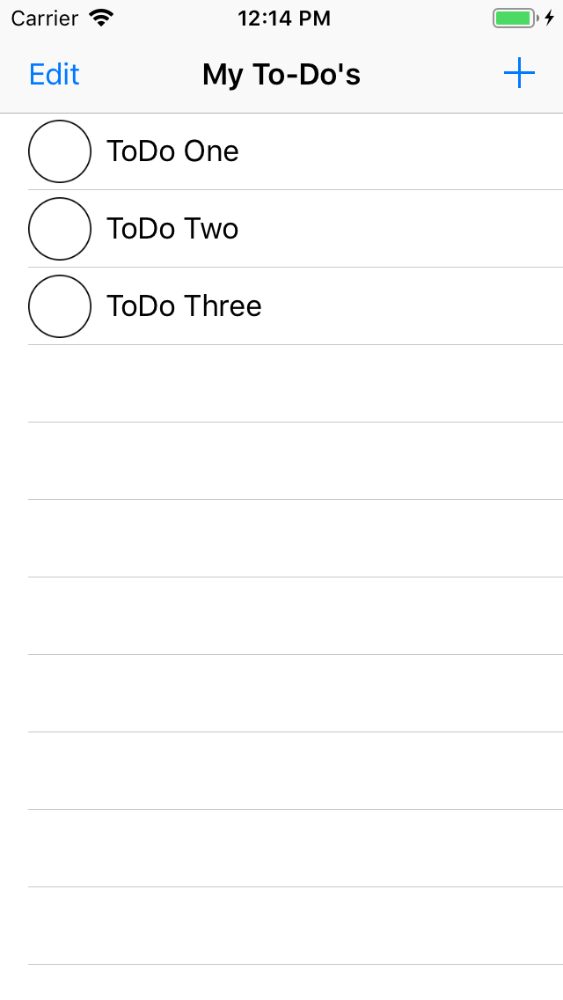
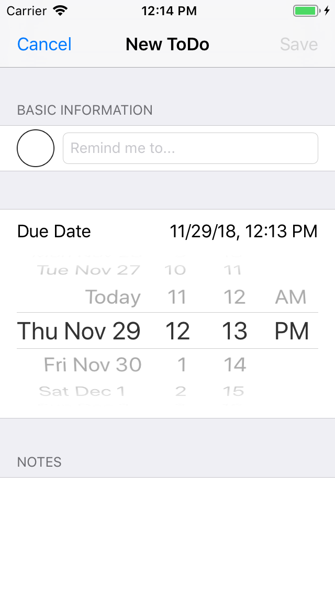
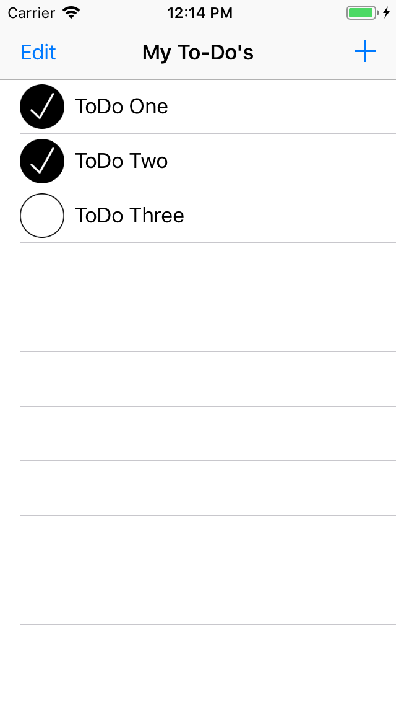

# SuzanZuurmond-Unit4-ToDoList
End project of Unit 4.

In this week, a guided project is build: ToDoList. This app functions as a list of todo's, which can be added via an add-button. ToDo's contain a name, due-date and description.

   
